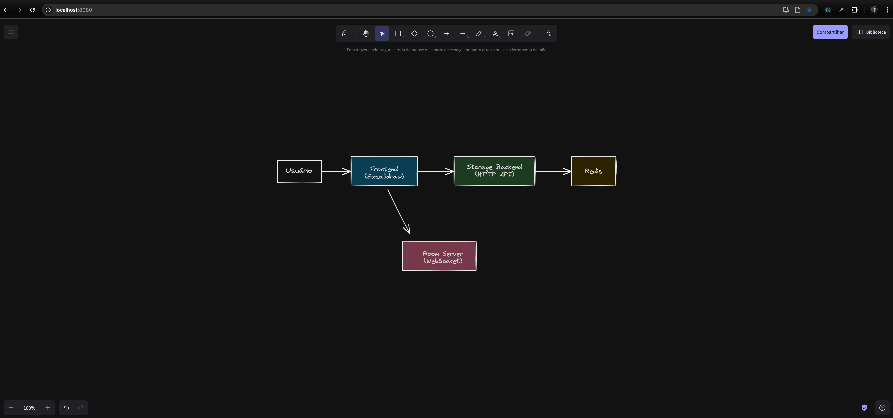

### Excalidraw (rodando localmente)



**O que é**

Excalidraw é um quadro branco/negro virtual de código aberto, com visual de desenho à mão, ideal para diagramas, wireframes e colaboração em tempo real. Este repositório está configurado para permitir que você rode a aplicação localmente usando Docker Compose, incluindo:

- **Frontend** Excalidraw
- **Backend de storage** (para salvar e carregar cenas)
- **Servidor de salas** (WebSocket) para colaboração em tempo real
- **Redis** (usado pelo backend de storage)

---

### Pré-requisitos

- Docker
- Docker Compose

---

### Como rodar

1. Suba os serviços com Docker Compose:

```bash
docker compose up -d
```

2. Acesse no navegador:

- Frontend: `http://localhost:8080`
- Storage API (para ver se está online): `http://localhost:8081/api/v2` (endpoints internos usados pelo app)
- Room server (WebSocket): `ws://localhost:8082`

> Observação: as portas são mapeadas conforme o `docker-compose.yml` deste projeto.

---

### O que o docker-compose sobe

- `frontend` (porta host 8080 → container 80)
  - Usa variáveis `VITE_*` apontando para os serviços internos `storage` e `room` na rede do Docker.
- `storage` (porta host 8081 → container 8080)
  - API em `GLOBAL_PREFIX=/api/v2`
  - Persiste em `STORAGE_URI=redis://redis:6379`
- `room` (porta host 8082 → container 80)
  - Servidor de WebSocket para colaboração
- `redis` (porta host 6379 → container 6379)

---

### Variáveis importantes (já configuradas no compose)

- `VITE_APP_BACKEND_V2_GET_URL`: `http://storage:8081/api/v2/scenes/`
- `VITE_APP_BACKEND_V2_POST_URL`: `http://storage:8081/api/v2/scenes/`
- `VITE_APP_HTTP_STORAGE_BACKEND_URL`: `http://storage:8081/api/v2`
- `VITE_APP_STORAGE_BACKEND`: `http`
- `VITE_APP_WS_SERVER_URL`: `ws://room:80`

Essas variáveis fazem o frontend falar com o backend e o servidor de salas dentro da rede do Docker. Pelo host, você acessa via `localhost` nas portas expostas.

---

### Comandos úteis

Parar os serviços:

```bash
docker compose down
```

Ver logs de um serviço (ex.: storage):

```bash
docker compose logs -f storage
```

Recriar imagens/serviços (caso atualize imagens):

```bash
docker compose up -d --pull always --force-recreate
```

---

### Perguntas frequentes

- Não consigo acessar o app na porta 8080

  - Verifique se as portas 8080/8081/8082/6379 não estão em uso por outros processos.
  - Rode `docker compose ps` para checar o status dos containers.

- Como persistir dados do Redis?
  - Você pode montar um volume no serviço `redis` no `docker-compose.yml` para persistência local.

---

### Licença

Este setup utiliza imagens públicas e/ou mantidas pelo autor do repositório. O projeto Excalidraw é disponibilizado sob licença MIT. Consulte o arquivo `LICENSE` e os READMEs dos subprojetos para detalhes.
